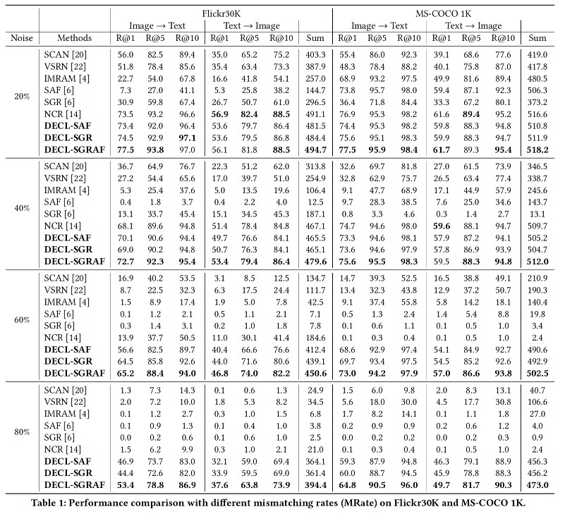
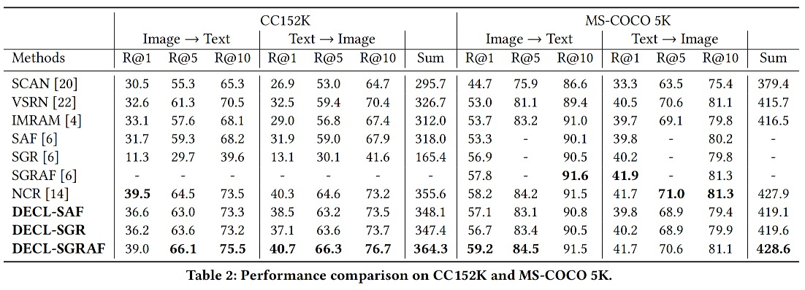

PyTorch implementation for [Deep Evidential Learning with Noisy Correspondence for Cross-modal Retrieval](https://drive.google.com/file/d/1YVXD2ki5txBY6khG62EHwCi6cnQVRE4I/view) (ACM Multimedia 2022).

## Update
2022-12-20. We provide the results using the same noise index as [NCR](https://github.com/XLearning-SCU/2021-NeurIPS-NCR), which might be helpful to your research.

<div class="tg-wrap"><table><tbody><tr><td></td><td>Datasets</td><td colspan="7">Flickr30K 1K test</td><td colspan="6">MS-COCO 1K 5-fold test</td><td></td><td colspan="6">MS-COCO 5K  test</td><td></td></tr><tr><td>Noise (%)</td><td>Methods\Metrics</td><td>R@1</td><td>R@5</td><td>R@10</td><td>R@1</td><td>R@5</td><td>R@10</td><td>Sum</td><td>R@1</td><td>R@5</td><td>R@10</td><td>R@1</td><td>R@5</td><td>R@10</td><td>Sum</td><td>R@1</td><td>R@5</td><td>R@10</td><td>R@1</td><td>R@5</td><td>R@10</td><td>Sum</td></tr><tr><td rowspan="4">20 </td><td>NCR</td><td>75.0 </td><td>93.9 </td><td>97.5 </td><td>58.3 </td><td>83.0 </td><td>89.0 </td><td>496.7 </td><td>78.7 </td><td>95.8 </td><td>98.5 </td><td>63.3 </td><td>90.4 </td><td>95.8 </td><td>522.5 </td><td>56.9 </td><td>83.6 </td><td>91.0 </td><td>40.6 </td><td>69.8 </td><td>80.1 </td><td>422.0 </td></tr><tr><td>DECL-SAF</td><td>73.1 </td><td>93.0 </td><td>96.2 </td><td>57.0 </td><td>82.0 </td><td>88.4 </td><td>489.7 </td><td>77.2 </td><td>95.9 </td><td>98.4 </td><td>61.6 </td><td>89.0 </td><td>95.3 </td><td>517.4 </td><td>54.9 </td><td>82.5 </td><td>90.3 </td><td>40.1 </td><td>68.9 </td><td>79.6 </td><td>416.3 </td></tr><tr><td>DECL-SGR</td><td>75.4 </td><td>93.2 </td><td>96.2 </td><td>56.8 </td><td>81.7 </td><td>88.4 </td><td>491.7 </td><td>76.9 </td><td>95.3 </td><td>98.2 </td><td>61.3 </td><td>89.0 </td><td>95.1 </td><td>515.8 </td><td>55.7 </td><td>82.2 </td><td>90.1 </td><td>39.8 </td><td>68.8 </td><td>79.4 </td><td>416.0 </td></tr><tr><td>DECL-SGRAF</td><td>75.6 </td><td>93.8 </td><td>97.4 </td><td>58.5 </td><td>82.9 </td><td>89.4 </td><td>497.6 </td><td>78.4 </td><td>95.8 </td><td>98.4 </td><td>63.0 </td><td>89.9 </td><td>95.6 </td><td>521.1 </td><td>57.2 </td><td>83.9 </td><td>90.9 </td><td>41.5 </td><td>69.9 </td><td>80.5 </td><td>423.9 </td></tr><tr><td rowspan="4">50 </td><td>NCR</td><td>72.9 </td><td>93.0 </td><td>96.3 </td><td>54.3 </td><td>79.8 </td><td>86.5 </td><td>482.8 </td><td>74.6 </td><td>94.6 </td><td>97.8 </td><td>59.1 </td><td>87.8 </td><td>94.5 </td><td>508.4 </td><td>53.1 </td><td>80.7 </td><td>88.5 </td><td>37.9 </td><td>66.6 </td><td>77.8 </td><td>404.6 </td></tr><tr><td>DECL-SAF</td><td>68.4 </td><td>90.9 </td><td>95.6 </td><td>51.9 </td><td>78.5 </td><td>85.9 </td><td>471.2 </td><td>74.6 </td><td>95.0 </td><td>98.2 </td><td>59.3 </td><td>88.1 </td><td>94.5 </td><td>509.7 </td><td>52.6 </td><td>80.7 </td><td>88.6 </td><td>37.8 </td><td>66.6 </td><td>77.8 </td><td>404.1 </td></tr><tr><td>DECL-SGR</td><td>71.3 </td><td>90.7 </td><td>94.6 </td><td>52.2 </td><td>78.7 </td><td>86.0 </td><td>473.5 </td><td>74.4 </td><td>94.2 </td><td>98.0 </td><td>58.8 </td><td>87.6 </td><td>94.3 </td><td>507.3 </td><td>53.1 </td><td>80.3 </td><td>88.5 </td><td>37.3 </td><td>66.4 </td><td>77.7 </td><td>403.3 </td></tr><tr><td>DECL-SGRAF</td><td>72.7 </td><td>92.0 </td><td>95.8 </td><td>54.8 </td><td>80.4 </td><td>87.5 </td><td>483.2 </td><td>76.1 </td><td>95.0 </td><td>98.3 </td><td>60.5 </td><td>88.7 </td><td>94.9 </td><td>513.5 </td><td>54.8 </td><td>82.0 </td><td>89.5 </td><td>38.8 </td><td>67.8 </td><td>78.9 </td><td>411.8 </td></tr></tbody></table></div>

## Introduction

### DECL framework


## Requirements

- Python 3.8
- PyTorch (>=1.10.0)
- numpy
- scikit-learn
- TensorBoard
- Punkt Sentence Tokenizer:
  
```
import nltk
nltk.download()
> d punkt
```
  
## Datasets

Our directory structure of ```data```.
```
data
├── f30k_precomp # pre-computed BUTD region features for Flickr30K, provided by SCAN
│     ├── train_ids.txt
│     ├── train_caps.txt
│     ├── ......
│
├── coco_precomp # pre-computed BUTD region features for COCO, provided by SCAN
│     ├── train_ids.txt
│     ├── train_caps.txt
│     ├── ......
│
├── cc152k_precomp # pre-computed BUTD region features for cc152k, provided by NCR
│     ├── train_ids.txt
│     ├── train_caps.tsv
│     ├── ......
│   
├── noise_file # Randomly shuffle the index of the image proportionally.
│     ├── f30k
│     │     ├── noise_inx_0.2.npy
│     │     ├── ......
│     │ 
│     └── coco
│           ├── noise_inx_0.2.npy
│           ├── ......     
│
└── vocab  # vocab files provided by SCAN and NCR
      ├── f30k_precomp_vocab.json
      ├── coco_precomp_vocab.json
      └── cc152k_precomp_vocab.json
```

### MS-COCO and Flickr30K
We follow [SCAN](https://github.com/kuanghuei/SCAN) to obtain image features and vocabularies.

### CC152K
Following [NCR](https://github.com/XLearning-SCU/2021-NeurIPS-NCR), we use a subset of [Conceptual Captions](https://ai.google.com/research/ConceptualCaptions) (CC), named CC152K. CC152K contains training 150,000 samples from the CC training split, 1,000 validation samples and 1,000 testing samples from the CC validation split.

[Download Dataset](https://ncr-paper.cdn.bcebos.com/data/NCR-data.tar)

### Noise index
If you want to experiment with the same noise index as in the paper, the noise index files can be downloaded from [here](https://drive.google.com/file/d/1-PJTDZRMo68mtY-hzPXheaakOVRkY5Ie/view?usp=sharing).


## Training and Evaluation

### Training new models
Modify some necessary parameters (i.e., ```data_path```, ```vocab_path```, ```noise_ratio```, ```warmup_epoch```, ```module_name```, and ```folder_name``` ) in ```train_xxx.sh``` file and run it.

For Flickr30K:
```
sh train_f30k.sh
```

For MSCOCO:
```
sh train_coco.sh
```

For CC152K:
```
sh train_cc152k.sh
```

### Evaluation
Modify the  ```data_path```, ```vocab_path```, ```checkpoint_paths``` in the ```eval.py``` file and run it.
```
python eval.py
```

Our reproduced results in [evaluation_log](https://drive.google.com/file/d/1N14yx5YE6kT1h9TvcJi8w3ALlSl3TbUc/view?usp=sharing). (Better than the original paper)

### Experiment Results:




## Citation
If DECL is useful for your research, please cite the following paper:
```
@inproceedings{Qin2022DECL,
    author = {Qin, Yang and Peng, Dezhong and Peng, Xi and Wang, Xu and Hu, Peng},
    title = {Deep Evidential Learning with Noisy Correspondence for Cross-Modal Retrieval},
    year = {2022},
    doi = {10.1145/3503161.3547922},
    booktitle = {Proceedings of the 30th ACM International Conference on Multimedia},
    pages = {4948–4956},
    numpages = {9},
    location = {Lisboa, Portugal},
    series = {MM '22}
}
```

## License

[Apache License 2.0](http://www.apache.org/licenses/LICENSE-2.0)

## Acknowledgements
The code is based on [NCR](https://github.com/XLearning-SCU/2021-NeurIPS-NCR), [SGRAF](https://github.com/Paranioar/SGRAF), and [SCAN](https://github.com/kuanghuei/SCAN) licensed under Apache 2.0.
