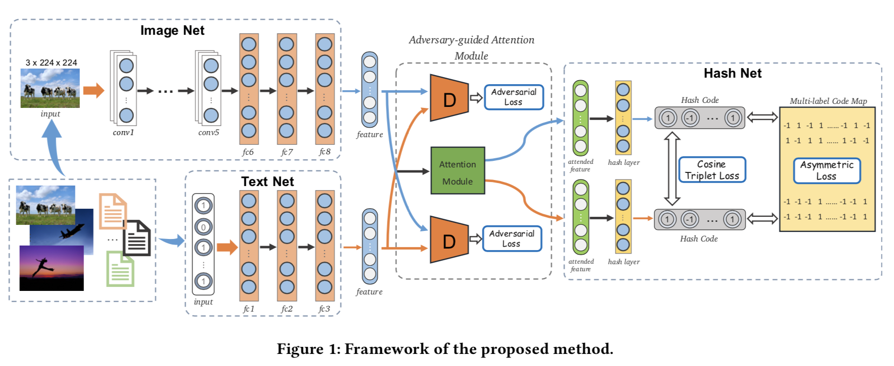
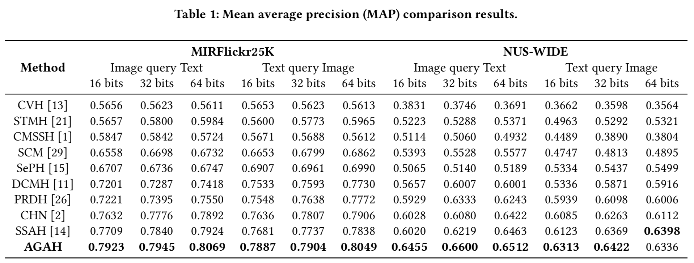

# Adversary Guided Asymmetric Hashing for Cross-Modal Retrieval

Code for the paper [Adversary Guided Asymmetric Hashing for Cross-Modal Retrieval](https://dl.acm.org/citation.cfm?doid=3323873.3325045) (ICMR 2019 Best Student Paper).

## Requirements

* Python >= 3.5
* PyTorch >= 1.0.0

## Usage

### Help

```shell
python main.py help
```
You will get the following help information:
```
========================::HELP::=========================
    usage : python file.py <function> [--args=value]
    <function> := train | test | help
    example:
            python main.py train --lr=0.01
            python main.py help
    avaiable args (default value):
            load_model_path: None
            pretrain_model_path: ./data/imagenet-vgg-f.mat
            vis_env: None
            vis_port: 8097
            dataset: flickr25k
            data_path: ./data/FLICKR-25K.mat
            db_size: 18015
            num_label: 24
            tag_dim: 1386
            query_size: 2000
            training_size: 10000
            batch_size: 128
            emb_dim: 512
            valid: True
            valid_freq: 2
            max_epoch: 300
            bit: 64
            lr: 0.0001
            device: cuda:1
            alpha: 1
            beta: 0
            gamma: 0.001
            eta: 1
            mu: 1
            delta: 0.5
            lambd: 0.8
            margin: 0.3
            debug: False
            data_enhance: False
========================::HELP::=========================
```

### Train & Test

Train and test:
```shell
python main.py train
```

For test only:
```shell
python main.py test
```

## Datasets

Coming soon...

## Framework



## Result



## Citing AGAH

```
@inproceedings{gu2019adversary,
  title={Adversary Guided Asymmetric Hashing for Cross-Modal Retrieval},
  author={Gu, Wen and Gu, Xiaoyan and Gu, Jingzi and Li, Bo and Xiong, Zhi and Wang, Weiping},
  booktitle={Proceedings of the 2019 on International Conference on Multimedia Retrieval},
  pages={159--167},
  year={2019},
  organization={ACM}
}
```