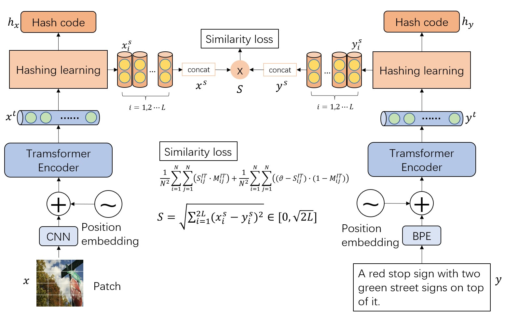
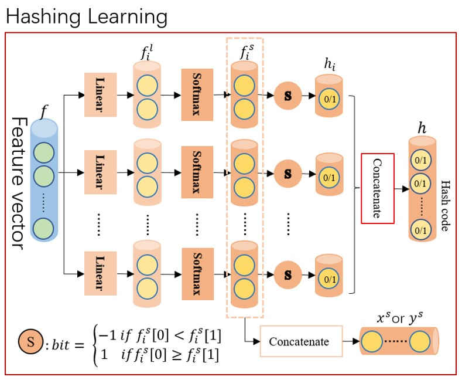
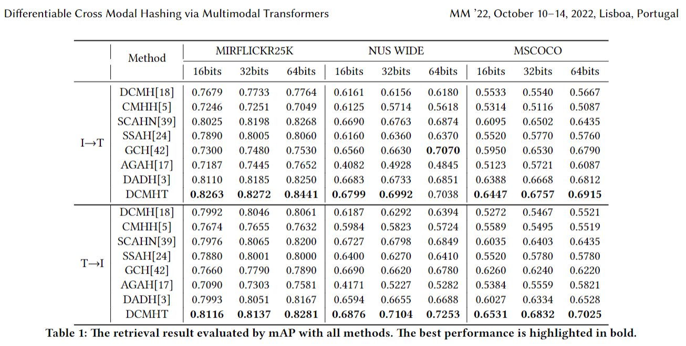

# Differentiable Cross Modal Hashing via Multimodal Transformers [paper](https://dl.acm.org/doi/abs/10.1145/3503161.3548187)

## Framework
The main architecture of our method.


We propose a selecting mechanism to generate hash code that will transfor the discrete space into a continuous space. Hash code will be encoded as a seires of $2D$ vectors.


## Dependencies
We use python to build our code, you need to install those package to run

- pytorch 1.9.1
- sklearn
- tqdm
- pillow

## Training

### Processing dataset
Before training, you need to download the oringal data from [coco](https://cocodataset.org/#download)(include 2017 train,val and annotations), [nuswide](https://lms.comp.nus.edu.sg/wp-content/uploads/2019/research/nuswide/NUS-WIDE.html)(include all), [mirflickr25k](https://www.kaggle.com/datasets/paulrohan2020/mirflickr25k)(include mirflickr25k and mirflickr25k_annotations_v080), 
then use the "data/make_XXX.py" to generate .mat file

For example:
> cd COCO_DIR # include train val images and annotations files
>
> mkdir mat
>
> cp DCMHT/data/make_coco.py mat 
>
> python make_coco.py --coco-dir ../ --save-dir ./

After all mat file generated, the dir of `dataset` will like this:
~~~
dataset
├── base.py
├── __init__.py
├── dataloader.py
├── coco
│   ├── caption.mat 
│   ├── index.mat
│   └── label.mat 
├── flickr25k
│   ├── caption.mat
│   ├── index.mat
│   └── label.mat
└── nuswide
    ├── caption.txt  # Notice! It is a txt file!
    ├── index.mat 
    └── label.mat
~~~

### Download CLIP pretrained model
Pretrained model will be found in the 30 lines of [CLIP/clip/clip.py](https://github.com/openai/CLIP/blob/main/clip/clip.py). This code is based on the "ViT-B/32".

You should copy ViT-B-32.pt to this dir.

### Start

After the dataset has been prepared, we could run the follow command to train.
> python main.py --is-train --hash-layer select --dataset coco --caption-file caption.mat --index-file index.mat --label-file label.mat --similarity-function euclidean --loss-type l2 --vartheta 0.75 --lr 0.0001 --output-dim 64 --save-dir ./result/coco/64 --clip-path ./ViT-B-32.pt --batch-size 256


## Result


## Citation
``` 
inproceedings{10.1145/3503161.3548187,
author = {Tu, Junfeng and Liu, Xueliang and Lin, Zongxiang and Hong, Richang and Wang, Meng},
title = {Differentiable Cross-Modal Hashing via Multimodal Transformers},
year = {2022},
booktitle = {Proceedings of the 30th ACM International Conference on Multimedia},
pages = {453–461},
numpages = {9},
}
```

## Acknowledegements
[CLIP](https://github.com/openai/CLIP)

[SSAH](https://github.com/lelan-li/SSAH)

[GCH](https://github.com/DeXie0808/GCH)

[AGAH](https://github.com/WendellGul/AGAH)

[DADH](https://github.com/Zjut-MultimediaPlus/DADH)

[deep-cross-modal-hashing](https://github.com/WangGodder/deep-cross-modal-hashing)


## Apologize:
*2023/03/01*

I find figure 1 with the wrong formula for the vartheta, the right one is the function (10). It has been published, so I can't fix it.
