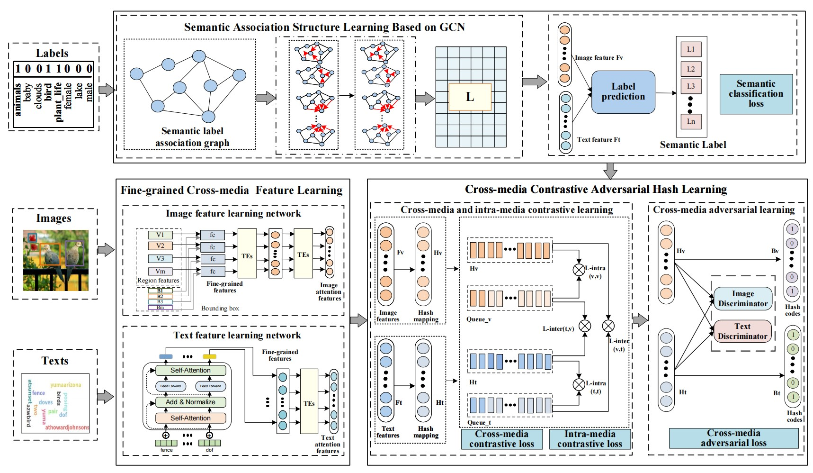

# **SCAHN implemented in mindspore**
## **Model Framework**

## **Environment installation**
>**mindspore 1.9.0\
>cuda 10.1\
>conda** (can be installed as follow)

    conda env create -f environment.yml
## **Run SCAHN**
    cd your_path_to_project/scahn-ms
    python train.py --config_path flickr25k.yaml
## **Config file**
### **Types of SCAHN**
Different types of SCAHN selections are:
|Loss function|Image encoder|
|---|---|
|paco loss|vision transformer|
|triplet loss|faster-RCNN + trasnformers|

Change variables loss_type and use_raw_img(True for VIT, False for faster-RCNN + transformers) in config file to change loss function and image encoder.\
If use faster-RCNN + transformers as image encoder, please provide image features and image boxes extracted by faster-RCNN, cause there's no implementation of faster-RCNN in this code.\
When changing variable use_raw_img, you should change variables img_seq and img_emb_dim in the same time.
### **Other parameters**
hash_bit:  16 / 32 / 64 / 128
### **Flickr 25k dataset and preextracted features**
You can download it from Baidu Netdisk:\
    [Download F25K Dataset](https://pan.baidu.com/s/1rjLuGfA4dGdpI76oy8_GWA?pwd=bupt)
### **Pretrained models converted from pytorch**
You can download it from Baidu Netdisk:\
    [Download Pretrained Model](https://pan.baidu.com/s/1TTf6pLJ40SzboWqaciutaw?pwd=bupt)
