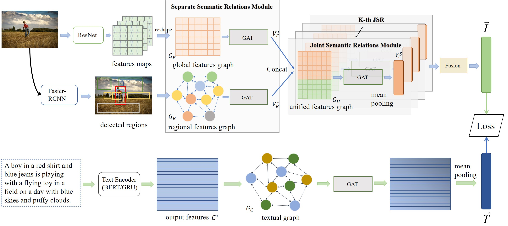

# Introduction
This is the official source code for **Dual Semantic Relations Attention Network(DSRAN)** proposed in our journal paper [Learning Dual Semantic Relations with Graph Attention for Image-Text Matching (TCSVT 2020)](https://arxiv.org/abs/2010.11550). It is built on top of the [VSE++](https://github.com/fartashf/vsepp) in PyTorch.


**The framework of DSRAN:**



**The results on MSCOCO and Flickr30K dataset:(With BERT or GRU)**
<table>
  <tr>
    <td>GRU</td>
    <td colspan="3">Image-to-Text</td>
    <td colspan="3">Text-to-Image</td>
    <td></td>
  </tr>
  <tr>
    <td>Dataset</td>
    <td>R@1</td>
    <td>R@5</td>
    <td>R@10</td>
    <td>R@1</td>
    <td>R@5</td>
    <td>R@10</td>
    <td>Rsum</td>
  </tr>
  <tr>
    <td>MSCOCO-1K</td>                   
    <td>80.4</td>
    <td>96.7</td>
    <td>98.7</td>
    <td>64.2</td>
    <td>90.4</td>
    <td>95.8</td>
     <td>526.2</td>
  </tr>
  <tr>
    <td>MSCOCO-5K</td>      
    <td>57.6</td>
    <td>85.6</td>
    <td>91.9</td>
    <td>41.5</td>
    <td>71.9</td>
    <td>82.1</td>
     <td>430.6</td>
  </tr>
  <tr>  
    <td>Flickr30k</td>            
    <td>79.6</td>
    <td>95.6</td>
    <td>97.5</td>
    <td>58.6</td>
    <td>85.8</td>
    <td>91.3</td>
    <td>508.4</td>
  </tr>
</table>

<table>
  <tr>
    <td>BERT</td>
    <td colspan="3">Image-to-Text</td>
    <td colspan="3">Text-to-Image</td>
    <td></td>
  </tr>
  <tr>
    <td>Dataset</td>
    <td>R@1</td>
    <td>R@5</td>
    <td>R@10</td>
    <td>R@1</td>
    <td>R@5</td>
    <td>R@10</td>
    <td>Rsum</td>
  </tr>
  <tr>
    <td>MSCOCO-1K</td>       
    <td>80.6</td>
    <td>96.7</td>
    <td>98.7</td>
    <td>64.5</td>
    <td>90.8</td>
    <td>95.8</td>
     <td>527.1</td>
  </tr>
  <tr>
    <td>MSCOCO-5K</td>      
    <td>57.9</td>
    <td>85.3</td>
    <td>92.0</td>
    <td>41.7</td>
    <td>72.7</td>
    <td>82.8</td>
     <td>432.4</td>
  </tr>
  <tr>  
    <td>Flickr30k</td>      
    <td>80.5</td>
    <td>95.5</td>
    <td>97.9</td>
    <td>59.2</td>
    <td>86.0</td>
    <td>91.9</td>
    <td>511.0</td>
  </tr>
</table>

## Requirements and Installation
We recommended the following dependencies.
*  Python 3.6
*  PyTorch 1.1.0
*  NumPy (>1.12.1)
*  torchtext
*  pycocotools
*  nltk

## Download data

Download the raw images, pre-computed image features, pre-trained BERT models, pre-trained ResNet152 model and pre-trained DSRAN models. As for the raw images, they can be downloaded from [VSE++](https://github.com/fartashf/vsepp).

```
wget http://www.cs.toronto.edu/~faghri/vsepp/data.tar
wget http://www.cs.toronto.edu/~faghri/vsepp/vocab.tar
```
We refer to the path of extracted files for `data.tar` as `$DATA_PATH` while only raw images are used which are `coco` and `f30k`.

For pre-computed image features, they can be obtained from [VLP](https://github.com/LuoweiZhou/VLP). These zip files should be extracted into the fold `data/joint-pretrain`. We refer to the path of extracted `region_bbox_file(.h5)` as `$REGION_BBOX_FILE` and regional feature paths `feat_cls_1000/` for COCO and `trainval/` for FLICKR30K as `$FEATURE_PATH`.

Pre-trained ResNet152 model can be downloaded from [torchvision](https://download.pytorch.org/models/resnet152-b121ed2d.pth) and put in the root directory.
```
wget https://download.pytorch.org/models/resnet152-b121ed2d.pth
```
For our trained DSRAN models, you can download `runs.zip` on [Google Drive](https://drive.google.com/drive/folders/1SQiRpO3L8d9QxFSRdk31PZrxRUi3eXyW?usp=sharing) or `GRU.zip` together with `BERT.zip` on [BaiduNetDisk](https://pan.baidu.com/s/1H_iMH-QZETAdHLk03dBREA)(extract code:1119). There are totally 8 models (4 for each dataset).

Pre-trained BERT models are obtained form an old version of [transformers](https://github.com/huggingface/transformers). It is noticed that there's a simpler way of using BERT as seen in [transformers](https://github.com/huggingface/transformers). We'll update the code in the future. The pre-trained models we use can be downloaded from the same [Google Drive](https://drive.google.com/drive/folders/1SQiRpO3L8d9QxFSRdk31PZrxRUi3eXyW?usp=sharing) and [BaiduNetDisk](https://pan.baidu.com/s/1H_iMH-QZETAdHLk03dBREA)(extract code:1119) links. We refer to the path of extracted files for `uncased_L-12_H-768_A-12.zip` as `$BERT_PATH`.  


### Data Structure
```
├── data/
|   ├── coco/           /* MSCOCO raw images
|   |   ├── images/
|   |   |   ├── train2014/
|   |   |   ├── val2014/
|   |   ├── annotations/
|   ├── f30k/           /* Flickr30K raw images
|   |   ├── images/
|   |   ├── dataset_flickr30k.json
|   ├── joint-pretrain/           /* pre-computed image features
|   |   ├── COCO/
|   |   |   ├── region_feat_gvd_wo_bgd/
|   |   |   |   ├── feat_cls_1000/           /* $FEATURE_PATH
|   |   |   |   ├── coco_detection_vg_thresh0.2_feat_gvd_checkpoint_trainvaltest.h5  /* $REGION_BBOX_FILE
|   |   |   ├── annotations/
|   |   ├── flickr30k/
|   |   |   ├── region_feat_gvd_wo_bgd/
|   |   |   |   ├── trainval/                /* $FEATURE_PATH
|   |   |   |   ├── flickr30k_detection_vg_thresh0.2_feat_gvd_checkpoint_trainvaltest.h5  /* $REGION_BBOX_FILE
|   |   |   ├── annotations/
```

## Evaluate trained models

### Test on single model:

+ Test on MSCOCO dataset (1K and 5K simultaneously):

  + Test on BERT-based models:
  
  ```bash
  python evaluation_bert.py --model BERT/cc_model1 --fold --data_path "$DATA_PATH" --region_bbox_file "$REGION_BBOX_FILE" --feature_path "$FEATURE_PATH"
  ```
  
  + Test on GRU-based models:
  
  ```bash
  python evaluation.py --model GRU/cc_model1 --fold --data_path "$DATA_PATH" --region_bbox_file "$REGION_BBOX_FILE" --feature_path "$FEATURE_PATH"
  ```
  
+ Test on Flickr30K dataset:

  + Test on BERT-based models:
  
  ```bash
  python evaluation_bert.py --model BERT/f_model1 --data_path "$DATA_PATH" --region_bbox_file "$REGION_BBOX_FILE" --feature_path "$FEATURE_PATH"
  ```
  
  + Test on GRU-based models:
  
  ```bash
  python evaluation.py --model GRU/f_model1 --data_path "$DATA_PATH" --region_bbox_file "$REGION_BBOX_FILE" --feature_path "$FEATURE_PATH"
  ```

### Test on two-models ensemble and re-rank:

/* Remember to modify the "$DATA_PATH", "$REGION_BBOX_FILE" and "$FEATURE_PATH" in the .sh files.

+ Test on MSCOCO dataset (1K and 5K simultaneously):

  + Test on BERT-based models:
  
  ```bash
  sh test_bert_cc.sh
  ```
  
  + Test on GRU-based models:
  
  ```bash
  sh test_gru_cc.sh
  ```
  
+ Test on Flickr30K dataset:

  + Test on BERT-based models:
  
  ```bash
  sh test_bert_f.sh
  ```
  
  + Test on GRU-based models:
  
  ```bash
  sh test_gru_f.sh
  ```
  
## Train new models

Train a model with BERT on MSCOCO:

```bash
python train_bert.py --data_path "$DATA_PATH" --data_name coco --num_epochs 18 --batch_size 320 --lr_update 9 --logger_name runs/cc_bert --bert_path "$BERT_PATH" --ft_bert --warmup 0.1 --K 4 --feature_path "$FEATURE_PATH" --region_bbox_file "$REGION_BBOX_FILE"
```

Train a model with BERT on Flickr30K:

```bash
python train_bert.py --data_path "$DATA_PATH" --data_name f30k --num_epochs 12 --batch_size 128 --lr_update 6 --logger_name runs/f_bert --bert_path "$BERT_PATH" --ft_bert --warmup 0.1 --K 2 --feature_path "$FEATURE_PATH" --region_bbox_file "$REGION_BBOX_FILE"
```

Train a model with GRU on MSCOCO:

```bash
python train.py --data_path "$DATA_PATH" --data_name coco --num_epochs 18 --batch_size 300 --lr_update 9 --logger_name runs/cc_gru --use_restval --K 2 --feature_path "$FEATURE_PATH" --region_bbox_file "$REGION_BBOX_FILE"
```

Train a model with GRU on Flickr30K:

```bash
python train.py --data_path "$DATA_PATH" --data_name f30k --num_epochs 16 --batch_size 128 --lr_update 8 --logger_name runs/f_gru --use_restval --K 2 --feature_path "$FEATURE_PATH" --region_bbox_file "$REGION_BBOX_FILE"
```

## Acknowledgement
We thank [Linyang Li](https://github.com/LinyangLee) for the help with the code and provision of some computing resources.
## Reference

If DSRAN is useful for your research, please cite our paper:

```
@ARTICLE{9222079,
  author={Wen, Keyu and Gu, Xiaodong and Cheng, Qingrong},
  journal={IEEE Transactions on Circuits and Systems for Video Technology}, 
  title={Learning Dual Semantic Relations With Graph Attention for Image-Text Matching}, 
  year={2021},
  volume={31},
  number={7},
  pages={2866-2879},
  doi={10.1109/TCSVT.2020.3030656}}
```

## License

[Apache License 2.0](http://www.apache.org/licenses/LICENSE-2.0)
