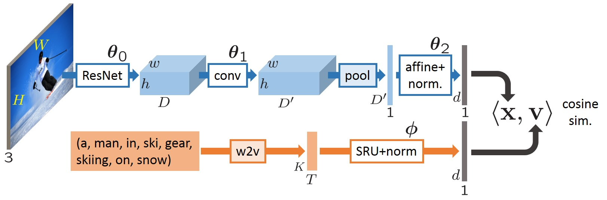

# Deep semantic-visual embedding with localization

Training and evaluation code for the paper [Finding beans in burgers: Deep semantic-visual embedding with localization](http://openaccess.thecvf.com/content_cvpr_2018/CameraReady/3272.pdf) 



This code allow training of new model, reproduction of experiments, as well as features extraction for both images and texts.

Author and contact: Martin Engilberge

## Main dependencies

This code is written in python. To use it you will need:

* Python 3.7
* Pytorch 1.0
* SRU[cuda]
* Numpy
* Scipy
* Torchvision
* Ms Coco API (pycocotools)
* Visual Genome API
* NLTK
* opencv

An environment file for conda is available in the repository (environment.yml).

## Getting started

You will first need to set the paths to the datasets and word embedding in the file misc/config.py 
Commentaries in the config file contains links where you can download the data.

To train and run model you will need:

* [Pre-initialized weights of the image pipeline](https://cloud.lip6.fr/index.php/s/sEiwuVj7UXWwSjf)

To reproduce experiments in the paper:

* [Weights of the model used in the paper](https://cloud.lip6.fr/index.php/s/RutL5MG2a0fpv1F)

Once the required paths have been set in the config file you can start training models using the following command:

```sh
python train.py
```

By default all the scripts use gpu, you can switch to cpu mode by uncommenting `device = torch.device("cpu")` at the beginning of the script.

## Model evaluation

Models can be evaluated on three tasks:

* cross modal retrieval:

```sh
python eval_retrieval.py -p "path/to/model/model.pth.tar" -te
```

* pointing game:

```sh
python pointing_game.py -p "path/to/model/model.pth.tar"
```

* semantic segmentation:

```sh
python semantic_seg.py -p "path/to/model/model.pth.tar"
```

## Features extraction
The features space produced by the joint embedding manages to capture semantic property.
Two scripts can be used to extract feature from that space for images and texts.

For images the script takes a folder as input and produces the embedding representation for all the jpeg images in the folder.
```sh
python image_features_extraction.py -p "path/to/model/model.pth.tar" -d "path/to/image/folder/" -o "path/to/output/file"
```

For text the script takes a text file and produces the embedding representation for each line.
```sh
python text_features_extraction.py -p "path/to/model/model.pth.tar" -d "path/to/text/file/" -o "path/to/output/file"
```

## Reference

If you found this code useful, please cite the following paper:

    @inproceedings{engilberge2018finding,
	  title={Finding beans in burgers: Deep semantic-visual embedding with localization},
	  author={Engilberge, Martin and Chevallier, Louis and P{\'e}rez, Patrick and Cord, Matthieu},
	  booktitle={Proceedings of the IEEE Conference on Computer Vision and Pattern Recognition},
	  pages={3984--3993},
	  year={2018}
	}

## License 
by downloading this program, you commit to comply with the license as stated in the LICENSE.md file.


