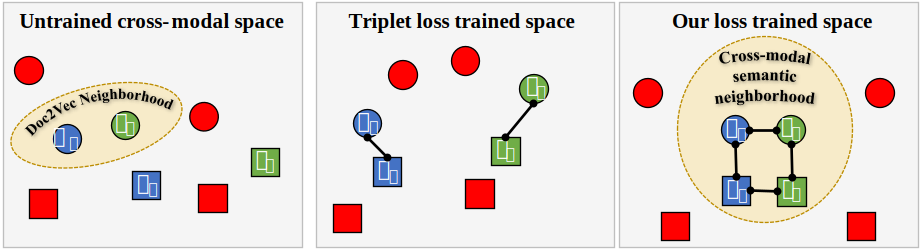

# Preserving Semantic Neighborhoods for Robust Cross-modal Retrieval [ECCV 2020]

> [**Preserving Semantic Neighborhoods for Robust Cross-modal Retrieval**](https://arxiv.org/abs/2007.08617),            
> [Christopher Thomas](https://www.cs.pitt.edu/~chris) and [Adriana Kovashka](https://www.cs.pitt.edu/~kovashka),
> *Proceedings of the European Conference on Computer Vision, 2020* 

__Video presentations (both short and long) of our paper are available on the [project webpage](https://www.cs.pitt.edu/~chris/semantic_neighborhoods).__

## Abstract
The abundance of multimodal data (e.g. social media posts with text and images) have inspired interest in cross-modal retrieval methods. However, most prior methods have focused on the case where image and text convey redundant information; in contrast, real-world image-text pairs convey complementary information with little overlap. Popular approaches to cross-modal retrieval rely on a variety of metric learning losses, which prescribe what the proximity of image and text should be, in the learned space. However, images in news articles and media portray topics in a visually diverse fashion; thus, we need to take special care to ensure a meaningful image representation. We propose novel within-modality losses which ensure that not only are paired images and texts close, but the expected image-image and text-text relationships are also observed. Specifically, our method encourages semantic coherency in both the text and image subspaces, and improves the results of cross-modal retrieval in three challenging scenarios. 

## Method Overview

<div align="center">
   
</div>

We propose a **metric learning approach** where we use the semantic relationships between **text segments, to guide the embedding learned for corresponding images**. In other words, to understand what an image "means", we look at what articles it appeared with. Unlike prior approaches, we capture this information not only across modalities, but **within** the image modality itself. If texts `y_i` and `y_j` are semantically similar, we learn an embedding where we explicitly encourage their paired images `x_i` and `x_j` to be similar, using a new unimodal loss. Note that in general `x_i` and `x_j` need not be similar in the original visual space. In addition, we encourage texts `y_i` and `y_j`, who were close in the unimodal space, to remain close. Our novel loss formulation explicitly encourages **within-modality semantic coherence**. We show how our method brings paired images and text closer, while also **preserving semantically coherent regions**, e.g. the texts remained close in the graphic above.

## Setup
This code was developed using Python 3.7.6. It requires PyTorch version 1.5.0, torchvision, and tensorboard.
[Anaconda](https://docs.anaconda.com/anaconda/install/) is also strongly recommended. You will also need the following packages not included in the Anaconda distribution:
```shell
conda install -c anaconda gensim 
conda install -c conda-forge nltk
```
Additionally, you will need to install [NMSlib](https://github.com/nmslib/nmslib) for nearest neighbor computation.

## Training a model

### Setup and neighborhood computation
Our method begins by calculating semantic neighborhoods in text space, using a pre-trained Doc2Vec model. These instructions all assume the [Politics](https://www.cs.pitt.edu/~chris/politics) dataset is used. However, the code can easily be modified to work with any image-text paired dataset. Begin by downloading the Politics dataset from [Politics](https://www.cs.pitt.edu/~chris/politics). You may need to adjust the path to the dataset in the code, as well as make sure that the paths to the images on your computer correspond to the relative paths in `train_test_paths.pickle`. In general, porting any arbitrary dataset requires little effort. 

```bash
# Train the Doc2Vec model on the train set of text from the Politics dataset.
python train_doc2vec.py

# Extract Doc2Vec vectors for the train set of text
python extract_doc2vec_vectors.py

# Perform approximate k-nearest neighbors using NMSLib
python knn_document_features.py
```

This implementation closely follows our method described in the text. However, you may need to adjust several parameters depending on the specifics of your dataset. For example, you may wish to train Doc2Vec for more than 20 epochs (e.g. we trained Doc2Vec for 50 epochs on COCO due to its smaller size). You may also consider training Doc2Vec on the entire articles from GoodNews, rather than just the captions. Similarly, we constrain the text to the first two sentences of the text in Politics (due to the lack of captions), but you may wish to train on the entire caption.

### Training
The prior steps trained a Doc2Vec model and calculated the semantic neighborhoods to be preserved for each image-text pair. We next train the cross-modal model with our constraints to preserve the semantic neighborhoods discovered in the previous step. The first parameter is the weight of the symmetric retrieval constraint (text to image retrieval). The second weight is the within-modality image retrieval constraint (image -> image neighbors, i.e. `L_img`), and the third is the text within-modality constraint, i.e. `L_text`. These should be optimized on your dataset.
```bash
# Train the cross-modal retrieval model
python train_cross_modal_retrieval_model.py 1 0.3 0.2  
```
Training should be stopped after validation loss fails to decrease after ~10 epochs.

## BibTex Citation

```bibtex
@inproceedings{thomas2020preserving,
  title={Preserving Semantic Neighborhoods for Robust Cross-modal Retrieval},
  author={Thomas, Christopher and Kovashka, Adriana},
  booktitle={Proceedings of the European Conference on Computer Vision (ECCV)},
  month = {August},
  year = {2020}
}
```
